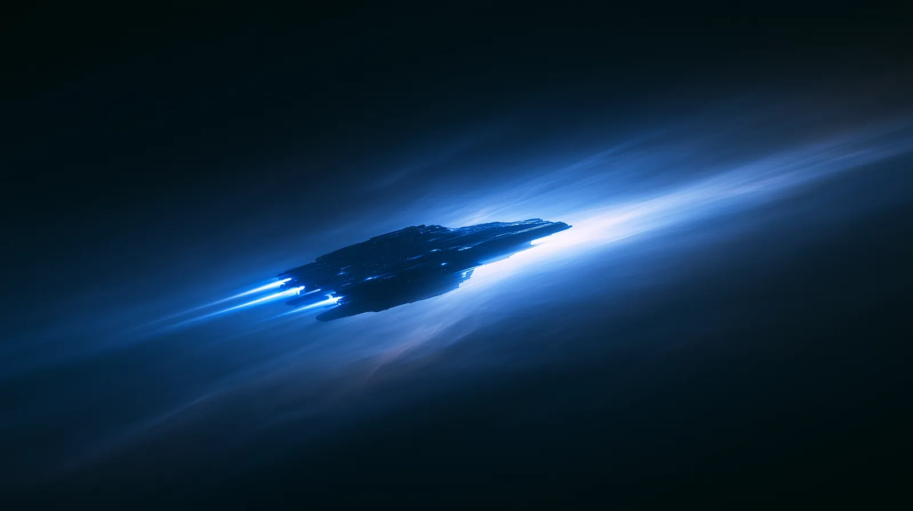

# Brand and links

## Official channels

| Channel  | Address                                                  |
| -------- | -------------------------------------------------------- |
| Website  | [zircofi.com](https://zircofi.com)                 |
| X        | [@ZircoFi](https://x.com/ZircoFi)                  |
| Contact  | hello@zircofi.com                                     |

Any other domain or handle claiming to be ZircoFi is not. Contract addresses will only ever be published on this documentation site and on the website.

## Name

The name is written **ZircoFi**, with a capital Z and a capital F, never in all caps in running text.

## Voice

The documentation and product speak the same way: calm, technical, precise. Short declarative sentences, numbers stated with their units, costs itemised rather than summarised, and risks in the reading path rather than the footnotes. No hype, no exclamation marks, no urgency theatre. If a sentence would not survive being read back by a sceptical auditor, it is rewritten until it would.

## Visual identity

The mark is a layered cloud: overlapping translucent sheets in teal, mint and periwinkle that build a single form on a pale field. It represents many sources of liquidity resolving into one clear price, which is what the venue does.

<figure><figcaption></figcaption></figure>

### Palette

| Token        | Hex       | Use                                  |
| ------------ | --------- | ------------------------------------ |
| Void         | `#020409` | Background                           |
| Deep         | `#050b1c` | Panels                               |
| Navy         | `#081848` | Panel gradients                      |
| Blue         | `#1f4fff` | Primary actions                      |
| Blue bright  | `#3d7bff` | Hover states                         |
| Blue soft    | `#78a8f8` | Labels                               |
| Blue pale    | `#b9d0ff` | Body text on dark                    |
| Cyan         | `#5ee4ff` | Accents, positive status             |
| Magenta      | `#ff7ad9` | Loss figures, warnings               |
| White        | `#f8f8ff` | Headings                             |

### Type

* Headings: Space Grotesk
* Body: Inter
* Labels and figures: JetBrains Mono

### Usage

* Keep the mark on a dark background. Do not place it on white.
* Do not recolour the mark or add effects; the flare is the mark.
* Leave clear space around the mark equal to at least half its width.

<figure><figcaption>
Hero artwork used on zircofi.com
</figcaption></figure>
